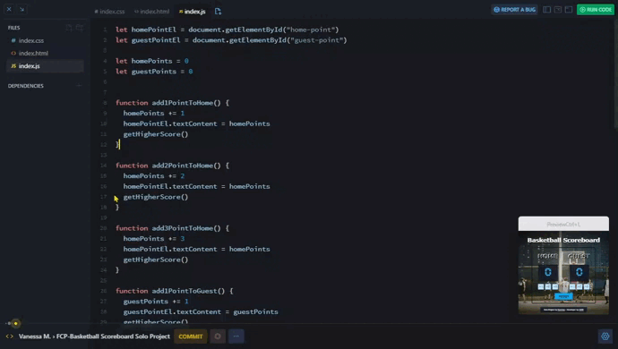

# Basketball Scoreboard - Solo Project

## *Overview* 🧐
This project is part of the "Making Websites Interactive" module from the [**Frontend Career Path**](https://v2.scrimba.com/the-frontend-developer-career-path-c0j) course by [**Scrimba**](https://v2.scrimba.com/home). The goal is to create a fully interactive basketball scoreboard from scratch, following the provided design and ensuring all buttons work as expected.

## *Requirements* 🎯

✅ Build it from "scratch".

✅ Follow the design.

✅ Make all six buttons work.

## *Stretch goals* 💪

✅ Add a "New Game" button

✅ Highlight the leader.

❌ ~~Add a few more counters (e.g. period, fouls, timer).~~

✅ Change the design.

## *Screenshots* 📷

## *Links* 🔗
[Scrim code](https://v2.scrimba.com/s07kg1un8r) 👈

[Live site](https://mendezpvi.github.io/fcp-basketball-scoreboard/) 👈

## *What I learned* 🤓

🔳 Using `@font-face` to integrate custom fonts.

🔳 Implementing **CSS grid** to create a flexible and responsive layout.

🔳 Dynamically changing styles with JavaScript using `.style`.

## *Resources* 🗃️

🗃️ Scrimba lessons and materials.

📖 [CSS Grid Layout Guide](https://css-tricks.com/snippets/css/complete-guide-grid/) by CSS Tricks

📖 [HTMLStyleElement](https://developer.mozilla.org/es/docs/Web/API/HTMLStyleElement) by MDN

📺 [How to use @FONT-FACE in CSS](https://www.youtube.com/watch?v=tVhMV9XETwY&t=672s) by Dorian Desings (Spanish)

📺 [Learn CSS Grid VERY EASY with exercises](https://www.youtube.com/watch?v=iTjkiI8QQsM) by Midudev (Spanish)

## *Author* 🔰

✨ Frontend Mentor - [@medezpvi](https://www.frontendmentor.io/profile/mendezpvi)

✨ X (formerly Twitter) - [@medezpvi](https://x.com/mendezpvi)